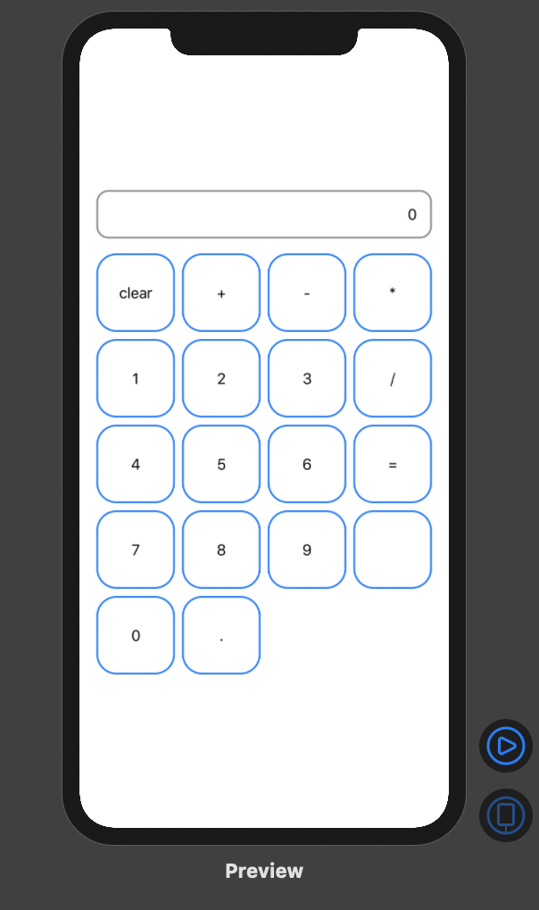

# CombineSwiftUICalculator

## Calculator


```swift
class CalculatorViewModel: ObservableObject {
    private var cancellables: [AnyCancellable] = []
    let didTapSubject = PassthroughSubject<CalculatorButton, Never>()

    private var lastOperator: CalculatorButton?
    private var lastNumber: NSNumber = 0
    private var currentNumber: NSNumber = 0
    @Published private(set) var labelString: String = "0"

    init() {
        setupObservable()
    }

    private func setupObservable() {

        let subscription = didTapSubject
            .print("CalculatorButton")
            .sink { calculatorButton in
                switch calculatorButton {
                case .plus, .subtract, .multiply, .divide, .equals:
                    self.inputOperator(calculatorButton)
                    break
                case .clear:
                    self.inputClear()
                    break
                case .empty:
                    break
                case .dot:
                    self.inputDot()
                    break
                case let .number(value):
                    self.inputNumber(value)
                    break
                }
        }

        cancellables = [subscription]
    }
}
```
